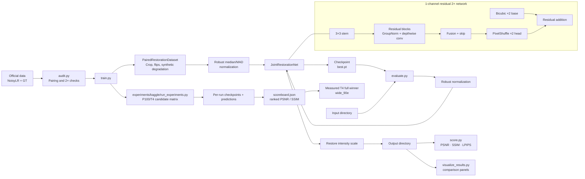

# Architecture

Last updated: 2026-08-15

## Boundaries

- `restoration/io.py` owns supported image discovery and grayscale read/write behavior.
- `restoration/data.py` owns pairing, augmentation, cropping, and normalization.
- `restoration/model.py` owns only the neural model topology.
- Command-line scripts orchestrate input/output paths and create reproducible artifacts. The Kaggle runner composes those existing entry points rather than duplicating training logic.

Update this diagram whenever a pipeline component, model boundary, persisted artifact, or evaluation dependency changes.
