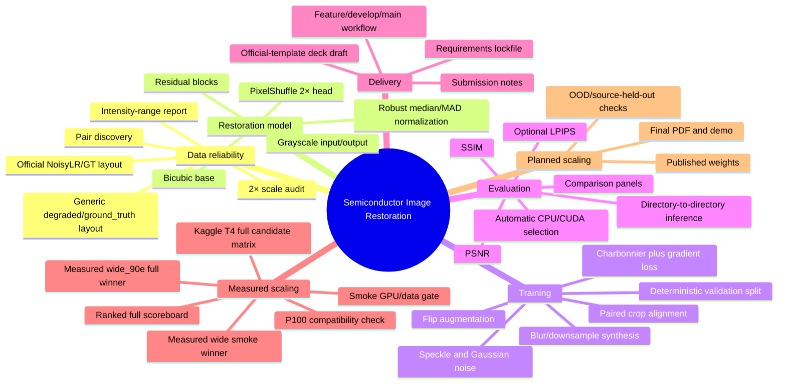

# Feature map

Last updated: 2026-08-15

## Ownership map

| Capability | Primary files |
| --- | --- |
| Data integrity | `audit.py`, `restoration/data.py`, `restoration/io.py` |
| Model topology | `restoration/model.py` |
| Optimization | `train.py` |
| Evaluator-facing restoration | `evaluate.py` |
| Metrics and evidence | `score.py`, `visualize_results.py` |
| Submission readiness | `README.md`, `submission/`, `docs/` |

Update this document whenever a user-visible capability is added, retired, or materially changes scope.
