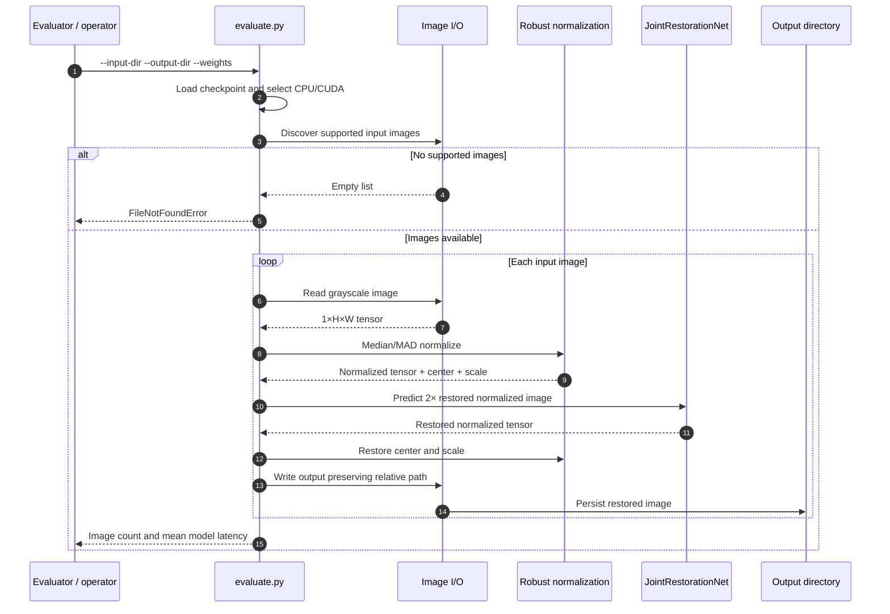

# Request flow

Last updated: 2026-08-12

## Failure behavior

| Condition | Current behavior | Follow-up action |
| --- | --- | --- |
| Missing model weights | Checkpoint load fails before processing. | Verify published model location and checksum. |
| Invalid input directory / unsupported files | Raises `FileNotFoundError`. | Provide supported grayscale image files. |
| Requested keys absent from input | Raises `FileNotFoundError` after filtering. | Reconcile the manifest with the input directory. |
| GPU unavailable | Defaults to CPU. | Use `--device cuda` only when a compatible CUDA runtime is available. |

Update this diagram and table whenever CLI arguments, validation, batching, hardware selection, output rules, or error behavior change.
